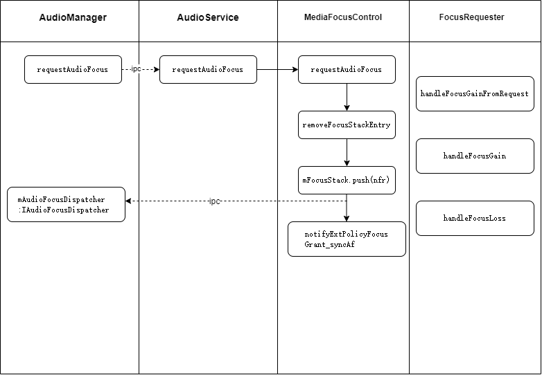

# AudioFocus分发流程

## 使用情景

在音视频app开发中一般会遵循音频焦点的机制，播放时申请音频焦点，丢失焦点后暂停播放，恢复焦点后继续播放等。尤其在车载开发时，涉及到三方应用和自研应用，导致经常出现音频焦点混乱混音等问题。

```kotlin
private fun requestAudioFocus() {
        getSystemService<AudioManager>()?.apply {
            val result = requestAudioFocus({
                Logger.d(TAG, "onAudioFocusChange: $it")
            }, AudioManager.STREAM_MUSIC, AudioManager.AUDIOFOCUS_GAIN)
            Logger.d(TAG, "requestAudioFocus ==> $result")
        }
    }
```

‍

## 调用流程

​​

整体是一个IPC调用流程，MediaFocusControl中维护了一个焦点栈，当栈数据发生变化时，会分发焦点状态给调用客户端

‍
