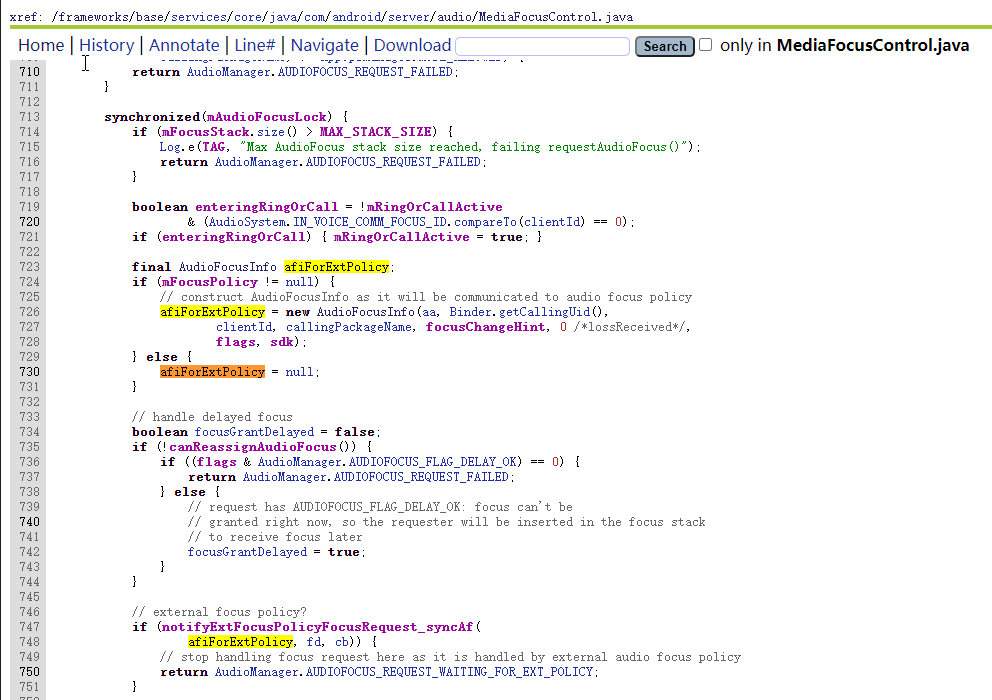

# 注册外部的AudioPolicy

‍

## 开始

> AudioFocus分发流程

在上面分发流程分析中，最终是在MediaFocusControl中进行处理的，在`requestAudioFocus`​方法中可以看到在执行焦点栈逻辑时会先执行AudioPolicy相关逻辑，

​​

因此我们试一试可不可以利用这一点，来注册外部的AudioPolicy，进行焦点变化监听。幸运的是可以，并且AudioManager中提供了`registerAudioPolicy`​方法，

可以通过反射来实现。

‍

## 示例代码

github地址：https://github.com/dongpingwang/MyAudio/tree/main/lib_audiofocus_monitor

```kotlin
    private val audioPolicy by lazy {
        val builder = AudioPolicy.Builder(context)
            .setIsAudioFocusPolicy(false)
        builder.setAudioPolicyFocusListener(object :
            AudioPolicy.AudioPolicyFocusListener() {
            override fun onAudioFocusGrant(
                afi: AudioFocusInfo?,
                requestResult: Int
            ) {
                Log.d(TAG, "onAudioFocusGrant: pkg=${afi?.packageName} result=$requestResult")
                monitors.forEach { it.onAudioFocusGrant(afi, requestResult) }
            }

            override fun onAudioFocusLoss(
                afi: AudioFocusInfo?,
                wasNotified: Boolean
            ) {
                Log.d(TAG, "onAudioFocusLoss: pkg=${afi?.packageName} wasNotified=$wasNotified")
                monitors.forEach { it.onAudioFocusLoss(afi, wasNotified) }
            }

            override fun onAudioFocusRequest(
                afi: AudioFocusInfo?,
                requestResult: Int
            ) {
                Log.d(TAG, "onAudioFocusRequest: pkg=${afi?.packageName} result=$requestResult")
                monitors.forEach { it.onAudioFocusRequest(afi, requestResult) }
            }

            override fun onAudioFocusAbandon(afi: AudioFocusInfo?) {
                Log.d(TAG, "onAudioFocusAbandon: pkg=${afi?.packageName}")
                monitors.forEach { it.onAudioFocusAbandon(afi) }
            }
        })
        builder.build()
    }

    private fun registerAudioPolicy() {
        context.getSystemService<AudioManager>()?.apply {
            val registerAudioPolicy =
                javaClass.getDeclaredMethod(
                    "registerAudioPolicy",
                    AudioPolicy::class.java
                )
            registerAudioPolicy.isAccessible = true
            val result = registerAudioPolicy.invoke(this, audioPolicy) as Int
            Log.d(TAG, "registerAudioPolicy: result=$result")
        }
    }
```

测试结果


## 注意点

需要系统应用权限；


