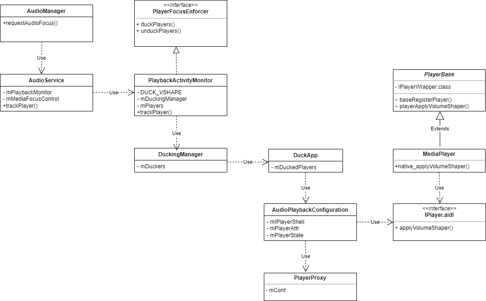

# 音量压低处理流程

## 开始

通过申请临时DUCK焦点可以压低其他在播放的音源，如源码中的注释，不会暂停其他在播放的音源，而是降低输出，在车载情景下，一般在地图导航或者语音播报的情景下会申请这个焦点。

```java
// AudioManager.java
/**
 * Used to indicate a temporary request of audio focus, anticipated to last a short
 * amount of time, and where it is acceptable for other audio applications to keep playing
 * after having lowered their output level (also referred to as "ducking").
 * Examples of temporary changes are the playback of driving directions where playback of music
 * in the background is acceptable.
 * @see OnAudioFocusChangeListener#onAudioFocusChange(int)
 * @see #requestAudioFocus(OnAudioFocusChangeListener, int, int)
 */
public static final int AUDIOFOCUS_GAIN_TRANSIENT_MAY_DUCK = 3;
```

我们在源码中进行全局搜索，应该是在/frameworks/base/services/core/java/com/android/server/audio/PlaybackActivityMonitor.java，我们接着看这个类

‍

## 流程

下面流程基于aosp9

​​

通过AudioManager申请临时DUCK焦点后，最终压低声音是由具体的Player进行压低的，通过native_applyVolumeShaper()实现。

具体细节待补充...

‍

‍

‍

## 参考文档

[使用 VolumeShaper 控制振幅](https://developer.android.google.cn/guide/topics/media/volumeshaper?hl=zh-cn)
